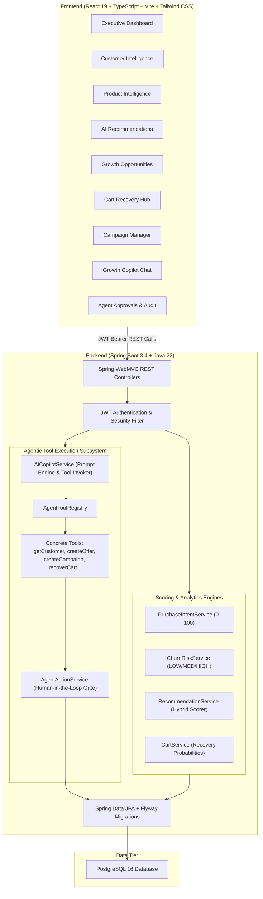
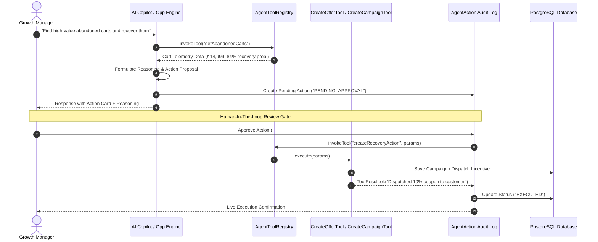

# GrowthPilot AI — Agentic Commerce Growth Platform

[](https://spring.io/projects/spring-boot)
[](https://react.dev/)
[](https://www.typescriptlang.org/)
[](https://tailwindcss.com/)
[](https://www.postgresql.org/)
[](http://localhost:8080/swagger-ui.html)

**GrowthPilot AI** is an autonomous e-commerce growth acceleration platform engineered for modern D2C and omnichannel retail businesses. Unlike generic chatbots or passive CRUD dashboards, GrowthPilot AI continuously monitors store telemetry, evaluates multi-factor customer purchase intent and churn risks, computes personalized product recommendations, and executes approved growth interventions through a deterministic **Autonomous Agent Tool Engine** with Human-in-the-Loop governance.

---

## 🌟 Key Features

1. **Autonomous Commerce Growth Copilot**: Real-time conversational agent capable of querying store metrics, detecting high-value abandoned carts, and proposing actionable decision cards directly in chat.
2. **Deterministic Purchase Intent Engine**: Explainable 0–100 multi-factor scoring based on recency, cart activity, spending power, and engagement affinity.
3. **Predictive Churn Risk Classifier**: Categorizes customer risk (`LOW`, `MEDIUM`, `HIGH`) and generates retention win-back copy with dynamic incentives.
4. **Hybrid Recommendation Engine**: Multi-signal product match engine factoring category affinity (+0.40), sales velocity (+0.25), price bracket matching (+0.20), and intent boost (+0.10).
5. **Cart Abandonment Recovery Hub**: Win-back probability calculation, dynamic coupon discounting, and instant recovery dispatch.
6. **Campaign & Offer Management**: Pipeline for targeted segment promotions with agent-created tags and impact forecasting.
7. **Human-in-the-Loop Governance & Audit Trail**: Every mutating AI action (coupons, campaigns, recovery messages) requires explicit manager approval before execution.

---

## 🏗️ System Architecture



---

## 🤖 Agent Execution & Human-in-the-Loop Lifecycle



---

## 📊 Analytics & Scoring Engines

### 1. Purchase Intent Formula
$$\text{Score} = \text{Recency}(30) + \text{Cart Activity}(30) + \text{Spending History}(25) + \text{Engagement}(15)$$
- **Score $\ge 75$**: `High Intent` — Immediate discount / checkout nudges.
- **Score $45 - 74$**: `Moderate Intent` — Category recommendations.
- **Score $< 45$**: `Low Intent` — Brand discovery & education.

### 2. Hybrid Product Recommendation Weighting
$$\text{Match Score} = 0.40 \cdot \text{Category Affinity} + 0.25 \cdot \text{Sales Velocity} + 0.20 \cdot \text{Price Match} + 0.10 \cdot \text{Intent Boost}$$

### 3. Cart Recovery Probability Matrix
- **Cart Value $> ₹10,000$ & Recency $< 24$h**: $80 - 95\%$ win-back probability (Incentive: Free Express Shipping + 10% Off).
- **Cart Value $< ₹2,000$**: $35 - 55\%$ win-back probability (Incentive: 5% Off).

---

## 🔌 API Documentation & Endpoints

Interactive Swagger UI is available at: `http://localhost:8080/swagger-ui.html`

| Endpoint | Method | Description |
| :--- | :--- | :--- |
| `/api/auth/login` | `POST` | User authentication & JWT generation |
| `/api/auth/register` | `POST` | Register store workspace & admin user |
| `/api/auth/me` | `GET` | Current authenticated user & store profile |
| `/api/dashboard/summary` | `GET` | Aggregated executive KPIs, trends & funnel telemetry |
| `/api/customers` | `GET` | Paginated customer intelligence explorer with filters |
| `/api/customers/{id}/intelligence` | `GET` | Full RFM, intent breakdown, churn rationale & recommendations |
| `/api/products` | `GET` | Product catalog with velocity and conversion stats |
| `/api/recommendations/customer/{id}` | `GET` | Top 5 explainable product recommendations for customer |
| `/api/opportunities` | `GET` | AI-detected growth levers with estimated INR impact |
| `/api/opportunities/generate` | `POST` | Re-scan catalog & generate fresh opportunities |
| `/api/opportunities/{id}/execute` | `POST` | Propose/execute growth opportunity via AI agent |
| `/api/carts/abandoned` | `GET` | List abandoned checkout sessions with win-back probability |
| `/api/campaigns` | `GET` / `POST` | Manage promotional campaigns and discounts |
| `/api/agent/chat` | `POST` | Natural language store telemetry inquiry with AI Copilot |
| `/api/agent/actions` | `GET` | Agent audit logs with status filter (`PENDING_APPROVAL`, `EXECUTED`, etc.) |
| `/api/agent/actions/{id}/approve` | `POST` | Approve and execute proposed growth action |
| `/api/agent/actions/{id}/reject` | `POST` | Reject proposed growth action |

---

## 🚀 Quickstart & Installation

### Option 1: Docker Compose (Recommended)
```bash
# 1. Start all containers (Postgres, Backend, Frontend)
docker compose up --build -d

# 2. Access Web Platform:
# Frontend: http://localhost:5173
# Backend: http://localhost:8080
# Swagger UI: http://localhost:8080/swagger-ui.html
```

### Option 2: Local Development

#### Prerequisites:
- Java 21 or 22
- Node.js 20+ and npm 10+
- PostgreSQL 15+ (or H2 test mode)

#### Backend:
```bash
cd backend
./mvnw clean package -DskipTests
java -jar target/backend-0.0.1-SNAPSHOT.jar
```

#### Frontend:
```bash
cd frontend
npm install
npm run dev
```

---

## 🔑 Demo Credentials

| Role | Email | Password |
| :--- | :--- | :--- |
| **Administrator** | `admin@techmart.in` | `password123` |
| **Growth Manager** | `manager@techmart.in` | `password123` |

*(A 1-click **"Fill Demo Credentials"** button is provided on the Login Page for instant evaluation)*

---

## 🧪 Testing

Run backend test suite:
```bash
cd backend
./mvnw test
```
*Includes unit tests for `PurchaseIntentService`, `ChurnRiskService`, `RecommendationService`, and `AgentToolRegistry`.*
